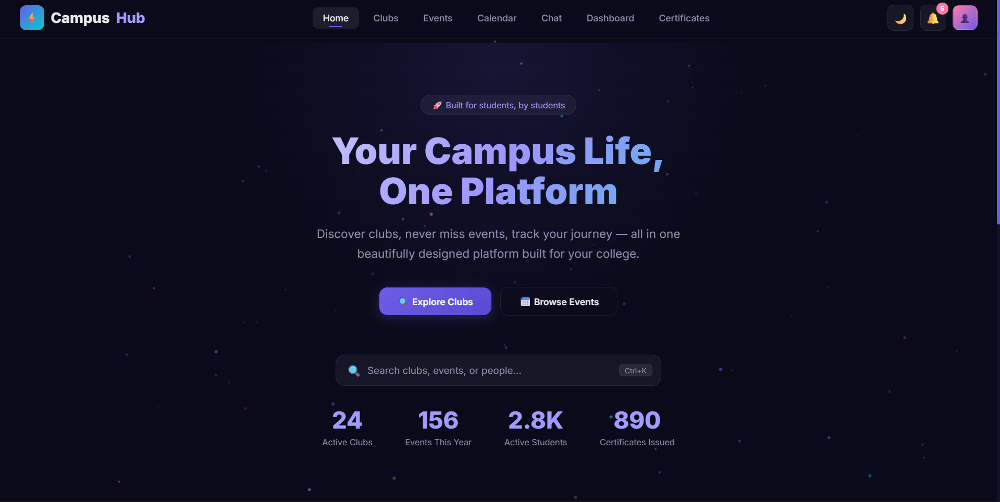
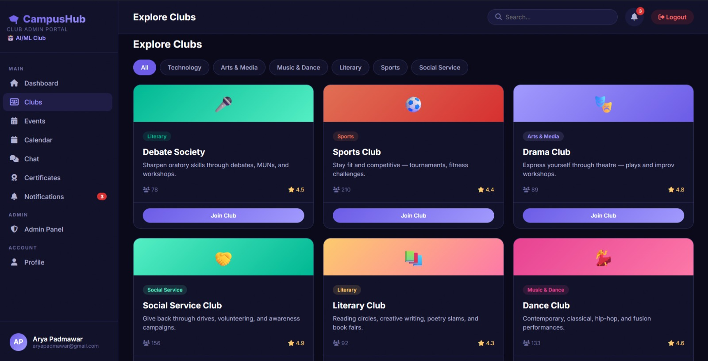
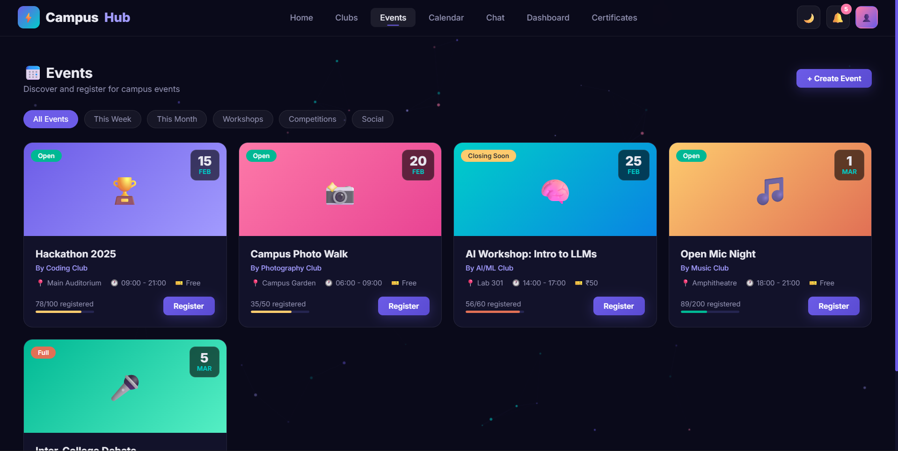
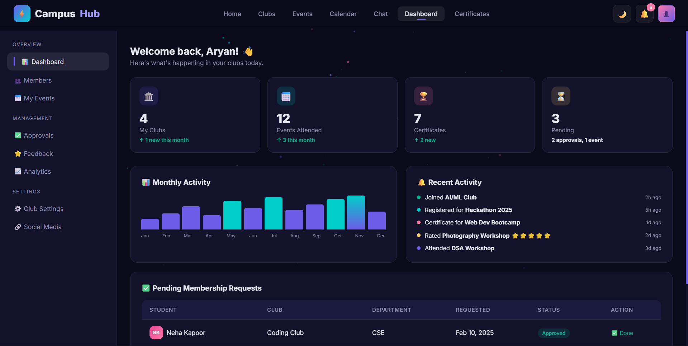

# ⚡ CampusHub

### College Clubs & Events Management Platform

 

  

*Discover clubs, never miss events, track your journey — all in one beautifully designed platform built for your college.*

 

[🚀 Live Demo]([(https://campushub-6q4c.onrender.com/)) · [🐛 Report Bug](https://github.com/YOUR_USERNAME/campushub/issues) · [✨ Request Feature](https://github.com/YOUR_USERNAME/campushub/issues)

---

## 📸 Screenshots

| Home Page | Clubs Page |
|:---------:|:----------:|
|  |  |

| Events | Dashboard |
|:------:|:---------:|
|  |  |

---

## ✨ Features

### 🏛️ Club Management
- Browse and discover 24+ active college clubs
- Filter clubs by category (Tech, Arts, Sports, Literary, etc.)
- Join clubs with membership approval system
- Create new clubs with admin approval workflow
- View detailed club profiles with member counts and ratings

### 📅 Event System
- Create and manage campus events
- Real-time registration with capacity tracking
- Event status indicators (Open, Closing Soon, Full)
- Visual capacity progress bars
- AI-powered event description generator

### 🗓️ Interactive Calendar
- Monthly calendar view with event markers
- Upcoming events sidebar
- Navigate between months
- Click on dates to see events

### 💬 Real-time Club Chat
- Club-based chat channels
- Real-time messaging between members
- Message history with timestamps
- Online member count
- Unread message indicators

### 📊 Dashboard & Analytics
- Personal activity dashboard
- Monthly activity charts
- Event attendance tracking
- Membership management (approve/reject)
- Club analytics and insights

### 🏆 Certificate System
- Auto-generated participation certificates
- Beautiful certificate design with signatures
- Download as PDF
- Share via link
- Certificate history table

### 🔐 Authentication
- Secure user registration and login
- JWT-based authentication
- Role-based access (Student, Club Lead, Admin)
- Profile management

### 🎨 UI/UX Features
- 🌙 Dark/Light mode toggle
- 🔍 Global search with keyboard shortcut (Ctrl+K)
- ✨ Particle animation background
- 🎊 Confetti celebrations on actions
- 📱 Fully responsive design
- ⬆️ Back-to-top button
- 🦴 Skeleton loading states
- 🔔 Notification system
- 🍞 Toast notifications

---

## 🛠️ Tech Stack

| Layer | Technology |
|-------|-----------|
| **Frontend** | HTML, CSS, JavaScript |
| **Backend** | Node.js, Express.js |
| **Database** | Supabase (PostgreSQL) |
| **Auth** | JWT (JSON Web Tokens), bCrypt, Brevo Email OTP |
| **Hosting** | Render, Github |

